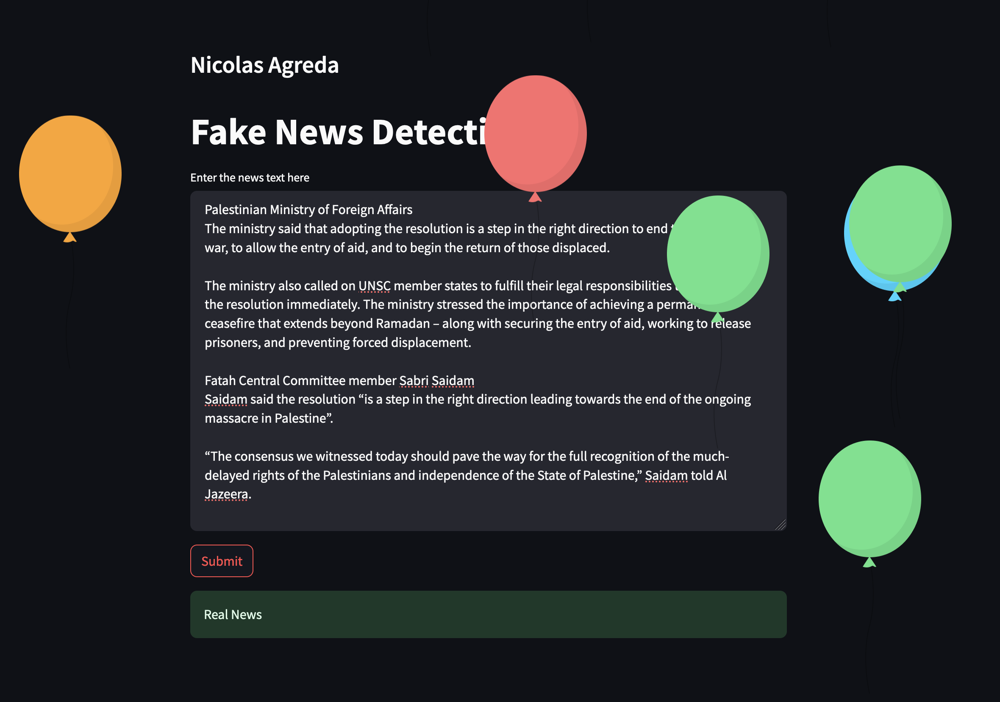

# Fake News Detection - NLP and Streamlit

This project is a complex NLP project that processes news text and determines whether it is fake or real. The code for the Jupyter Notebook can be found in `FakeNewsDetection.ipynb`. Also the project has a user-friendly front-end application with Streamlit library in python. It allows users to enter text, process it using a predefined function, and view the result in the web browser.



## Requirements

- Python 3.6+

## Setup

### macOS/Linux

1. Create a virtual environment:
    ```
    python3 -m venv venv
    ```

2. Activate the virtual environment:
    ```
    source ./venv/bin/activate
    ```

### Windows

1. Create a virtual environment:
    ```
    python -m venv venv
    ```

2. Activate the virtual environment:
    ```
    .\venv\Scripts\activate
    ```

### Install Dependencies

Install the required Python dependencies using pip:
```
pip install -r requirements.txt
```

## Usage

Run the Streamlit application:
```
streamlit run client.py
```

This command will start the Streamlit server and open the application in your default web browser. You can then enter text into the input box, click the "Submit" button, and view the processed result.